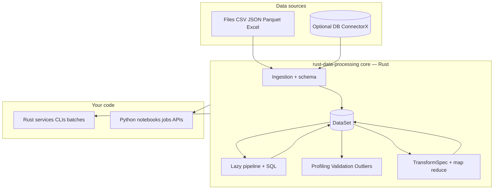
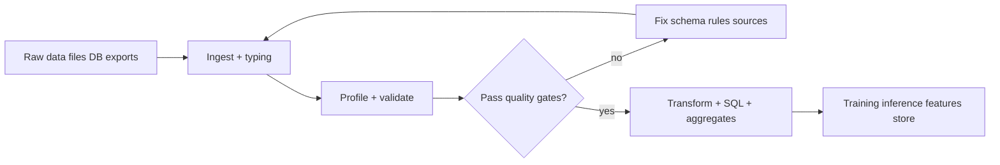
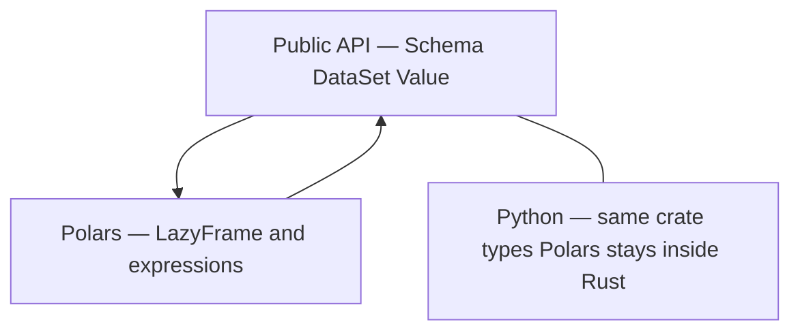
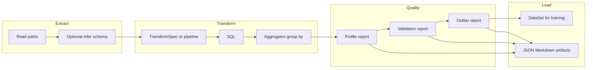

# LinkedIn post kit — `rust-data-processing`

This file is **not** the project README for developers; it is **marketing copy + diagrams** you can adapt for a LinkedIn post.  
**Repo:** [github.com/vihangdesai2018-png/rust-data-processing](https://github.com/vihangdesai2018-png/rust-data-processing)

---

## How to use the diagrams on LinkedIn

LinkedIn does not render Mermaid inside posts. Options:

1. Open [mermaid.live](https://mermaid.live), paste a diagram block, export **PNG** or **SVG**, attach to the post.
2. Use VS Code / GitHub preview on this file, screenshot the rendered diagram.
3. Keep diagrams **simple and high contrast** so they read on mobile.

---

## Suggested LinkedIn post (copy-paste)

*Approx. 1,150 characters — fits comfortably under LinkedIn’s limit with room for your sign-off.*

---

A large slice of real-world AI work is not the model — it’s **data**: loading files, fixing types, profiling distributions, catching bad rows, and shipping repeatable ETL transforms before anything reaches training or batch inference.

**`rust-data-processing`** is an open library that treats that work as first-class: **schema-first ingestion** (CSV, JSON, Parquet, Excel), a portable in-memory **`DataSet`**, **Polars-backed** lazy pipelines and **SQL**, plus **profiling**, **validation**, and **explainable outlier detection** — with the same ideas available from **Rust** (performance, safety) and **Python** (PyO3 + maturin) so teams can share one processing story across services and notebooks.

**Why reach for it instead of “just glue Polars/pandas together”?**  
You still get Polars horsepower where it matters, but behind a **small, engine-agnostic surface**: consistent ingestion errors, optional DB reads (feature-gated), declarative **`TransformSpec`**, JSON/Markdown **reports** for QA, and **map/reduce-style** primitives that mirror what feature pipelines actually do — without shipping Polars types through the Python public API.

**Good fits:** single-node ETL and ML preprocessing, data-quality gates, training datasets built from files + SQL-shaped transforms, Rust services that need the same logic as Python notebooks.

**Not the pitch:** distributed Spark-style clusters — that’s intentionally out of scope.

If this resonates, Docs + Python wrapper live in the repo — feedback welcome.

`#MachineLearning` `#DataEngineering` `#RustLang` `#Python` `#ETL` `#DataQuality`

---

## Shorter variant (~550 characters)

---

Most AI projects stall on **data prep**, not the model: ingest, validate, profile outliers, then repeatable transforms.

**`rust-data-processing`** does that in one stack: **Rust** for speed + safety, **Python** for notebooks and teams, schema-first file ingestion, **Polars-backed** pipelines + SQL, validation & profiling & outlier reports.

One surface for **ETL + ML feature prep** — not a distributed framework — built for engineers who want boring, fast preprocessing.

`#ML` `#DataEngineering` `#Rust` `#Python`

---

## Honest positioning (use this if someone asks “vs X?”)

| If you need… | This library… | Often paired with / alternative |
| --- | --- | --- |
| Single-node, library-style ETL + QA + transforms | Good fit: unified `DataSet`, reports, `TransformSpec` | Polars or pandas directly (you assemble pieces yourself) |
| Maximum SQL/analytics on huge laptops/servers | Strong via Polars delegation | DuckDB, raw Polars |
| Distributed batch across a cluster | Out of scope today | Spark, Ray, etc. |
| Only quick notebook exploration | pandas/Polars alone may be enough | This adds structure when you want stable APIs + Rust |

The differentiator is **intentionally narrow**: fewer moving parts in your own code, **one error and schema story**, and **Rust + Python** without exposing engine internals on the Python side.

---

## AI / ML preprocessing angle (talk track)

1. **Before training:** You need to know null rates, value ranges, and label skew. Profiling + validation turn “looks fine” into **JSON/Markdown artifacts** you can gate in CI or review in PRs.
2. **Feature engineering:** Map/filter/reduce and group-by aggregates are how many teams express **rolling stats, normalizers, and batch feature builds**. The same ops exist **in-memory** and **Polars-backed** for scale.
3. **Robustness:** Outlier helpers (e.g. IQR / z-score / MAD) with **explainable outputs** support monitoring and debugging — common in fraud, risk, and messy tabular ML.
4. **Two languages, one contract:** Train/experiment in **Python**; deploy hot paths or sidecars in **Rust** using the same crate — useful when ML touches production services.

---

## ETL / transformation angle (talk track)

1. **Land:** Ingest CSV / JSON / Parquet / Excel (and optional DB via ConnectorX, feature-gated) into a typed **`DataSet`**.
2. **Shape:** `TransformSpec` (serde-friendly) or pipeline wrappers — rename, cast, fill nulls, filter, join, aggregate.
3. **Query:** Polars-backed **SQL** for the slice of workloads that want SQL-shaped ETL.
4. **Observe:** Ingestion observers and severity thresholds for operational ETL (alerts on critical failures).

---

## Python examples (copy-paste)

**Install** (after the package is on PyPI):

```bash
pip install rust-data-processing
```

**From a repo checkout** (build the extension once): `cd python-wrapper` → `uv sync --group dev` → `uv run maturin develop --release` → run the same `import` from the repo root or any `PYTHONPATH` that includes `python-wrapper`.

### 1) Ingest a CSV with an explicit schema

```python
import rust_data_processing as rdp

schema = [
    {"name": "id", "data_type": "int64"},
    {"name": "name", "data_type": "utf8"},
]
ds = rdp.ingest_from_path("data/people.csv", schema, {"format": "csv"})
print("rows", ds.row_count())
```

### 2) Infer schema, then ingest (quick exploration)

```python
import rust_data_processing as rdp

ds = rdp.ingest_from_path_infer("data/people.csv")
print("rows", ds.row_count())
```

### 3) Profile before training (JSON report as a dict)

```python
import rust_data_processing as rdp

ds = rdp.ingest_from_path_infer("data/people.csv")
report = rdp.profile_dataset(ds, {"head_rows": 10_000, "quantiles": [0.5, 0.95]})
print("sampled rows:", report["row_count"])
```

### 4) Validation gates (e.g. not-null + rules)

```python
import rust_data_processing as rdp

ds = rdp.ingest_from_path_infer("data/people.csv")
result = rdp.validate_dataset(
    ds,
    {"checks": [{"kind": "not_null", "column": "id", "severity": "error"}]},
)
print("checks run:", result["summary"]["total_checks"])
```

### 5) SQL-shaped slice (single-table; table name is `df`)

```python
import rust_data_processing as rdp

ds = rdp.ingest_from_path_infer("data/events.csv")
out = rdp.sql_query_dataset(ds, "SELECT id, score FROM df WHERE score > 90 LIMIT 100")
print("filtered rows", out.row_count())
```

### 6) Lazy pipeline: select columns, then materialize

```python
import rust_data_processing as rdp

ds = rdp.ingest_from_path_infer("data/people.csv")
subset = rdp.DataFrame.from_dataset(ds).select(["id", "name"]).collect()
print("subset rows", subset.row_count())
```

More depth: [`python-wrapper/API.md`](../python-wrapper/API.md) and [`python-wrapper/README.md`](../python-wrapper/README.md).

---

## Diagram 1 — One library, two languages, shared core



---

## Diagram 2 — Where time goes in ML projects (why preprocessing matters)



---

## Diagram 3 — Engine-agnostic API, Polars under the hood



---

## Diagram 4 — ETL + ML prep on one path



---

## Optional closing line (pick one)

- “If your team lives in **Python** but wants **Rust** in production for the same data contract, this is the kind of bridge that keeps preprocessing boring.”
- “Great models on bad data fail quietly — **profile, validate, then transform**.”

---

## Changelog

- Initial version aligned with Phase 1 / Phase 1a scope (`Planning/PHASE1_PLAN.md`, `Planning/PHASE1A_PLAN.md`).
